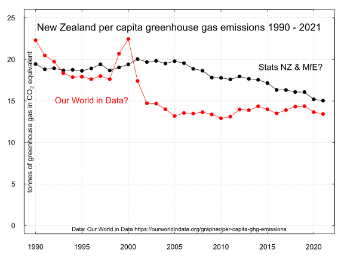

## New Zealand gross greenhouse gas emissions per capita and country and region comparisons 1990 to 2021 

### Description

This repository features the code to obtain data and to create a chart of New Zealand gross greenhouse gas emissions per capita and selected country and regional comparisons 1990 to 2021.

The data is from [Our World in Data](https://ourworldindata.org/grapher/per-capita-ghg-emissions?tab=chart&time=1990..2021&country=CHN~IND~OWID_WRL~NZL~GBR~OWID_EU27~OWID_AFR).

New Zealand and country comparisons chart 1990 to 2021

New Zealand only chart of per capita emissions 1990 to 2021

Chart of the New Zealand population from 1990. Data: Stats NZ via [FigureNZ](https://figure.nz/chart/MFMkVhvbhuVFbiWr)

Chart of New Zealand gross greenhouse gas emissions from 1990 from the [Ministry for the Environment](https://environment.govt.nz/publications/new-zealands-greenhouse-gas-inventory-1990-2021/).

New Zealand gross greenhouse gas emissions and country comparisons chart 1990 to 2018

### License

#### ODC-PDDL-1.0

This data and the R scripts are made available under the Public Domain Dedication and License v1.0 whose full text can be found at: http://www.opendatacommons.org/licenses/pddl/1.0/. You are free to share, to copy, distribute and use the data, to create or produce works from the data and to adapt, modify, transform and build upon the data, without restriction.

#### Index of data files

1. [per-capita-ghg-emissions.csv](per-capita-ghg-emissions.csv) (Data from Our World in Data)

2. [Population_Estimated_population_by_year_ended_June_19372023.csv](Population_Estimated_population_by_year_ended_June_19372023.csv) (Stats NZ population data sourced from FigureNZ)

3. [WorldResourcesInstituteCAIT.r](WorldResourcesInstituteCAIT.r)     (R script file of code to process data and to create chart)

4. [crfsummarydatasector.csv](crfsummarydatasector.csv)  (Summary NZ gross emissions from MfE Greenhouse Gas Inventory)

5. [PerCapData-GHG.csv](PerCapData-GHG.csv)  (the per capita data from WRI CAIT 1990 to 2018) 

6. [Licence.txt](Licence.txt) (Public Domain  Dedication and License v1.0 http://opendatacommons.org/licenses/pddl/1.0/)
